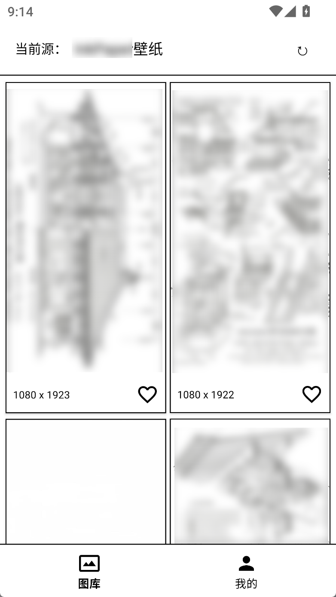
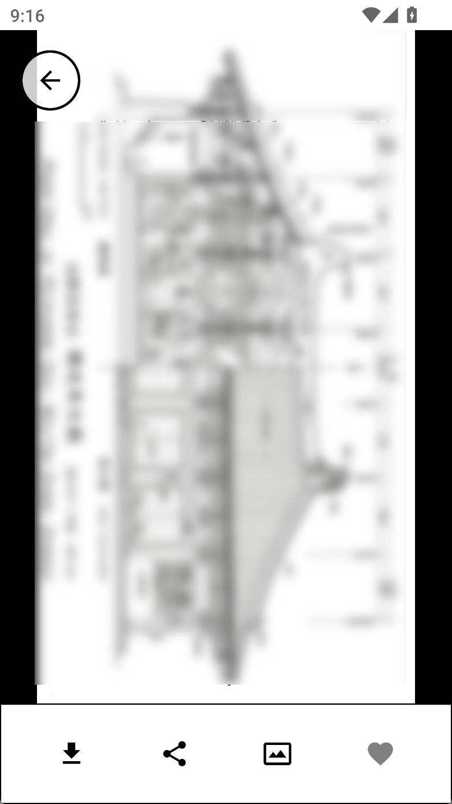
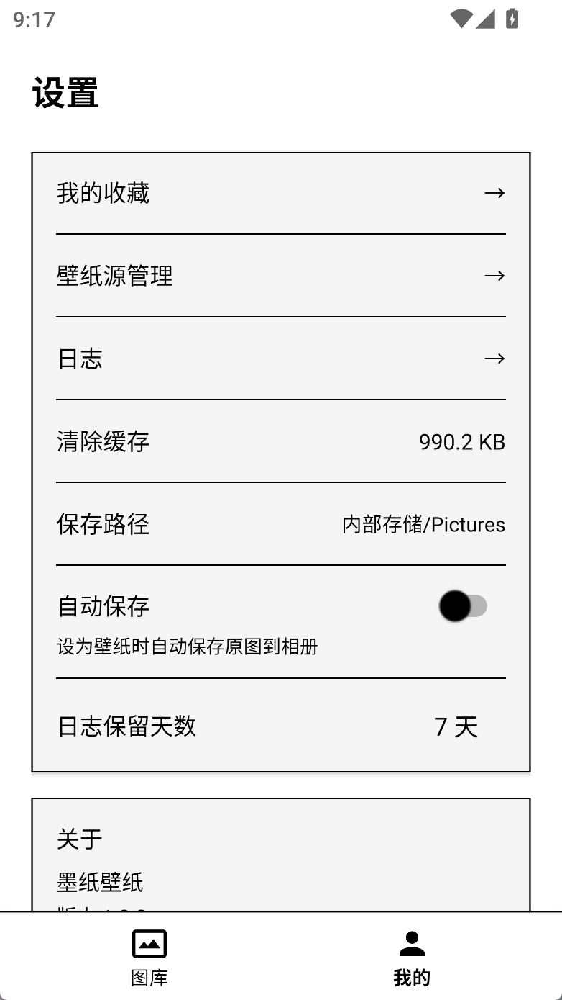

<p align="center">
  <a href="https://github.com/ACG-Q/inkdrop">
    
  </a>
</p>

<h1 align="center">墨纸壁纸</h1>

<p align="center">
  <strong>InkDrop Wallpaper</strong><br>
  一款专为墨水屏设计的 Android 壁纸应用
</p>

<p align="center">
  <a href="https://github.com/ACG-Q/inkdrop/releases"></a>
  <a href="https://github.com/ACG-Q/inkdrop/releases"></a>
  <a href="https://github.com/ACG-Q/inkdrop/blob/master/LICENSE"></a>
</p>

---

## 功能特性

- **纯黑白界面** — 专为墨水屏优化，低功耗显示
- **壁纸源管理** — 支持 JSON / JS / 302 脚本自定义壁纸源
- **壁纸操作** — 预览、下载、分享、设为桌面/锁屏
- **收藏管理** — 一键收藏喜欢的壁纸
- **自动保存** — 设为壁纸时自动保存原图到相册
- **运行日志** — 实时查看应用运行状态

## 开发文档

| 源类型 | 说明 |
|--------|------|
| [JSON 源](docs/sources/json.md) | 通过 HTTP API 获取壁纸列表 |
| [JS 源](docs/sources/js.md) | 通过 JavaScript 代码自定义获取逻辑 |
| [302 源](docs/sources/302.md) | 通过 HTTP 302 重定向获取随机壁纸 |

## 预览

| 图库 | 详情 | 设置 |
| :---: | :---: | :---: |
|  |  |  |

## 技术栈

| 模块 | 技术 |
|------|------|
| 语言 | Java |
| 依赖注入 | Hilt |
| 网络请求 | Retrofit + OkHttp |
| 图片加载 | Glide |
| 本地数据库 | Room |
| JS 引擎 | Rhino |
| 后台任务 | WorkManager |

## 构建

```bash
# Debug 构建
./gradlew assembleDebug

# Release 构建（需要签名配置）
./gradlew assembleRelease

# 安装到设备
./gradlew installDebug
```

## CI/CD

推送到 `master` 或创建 `v*` 标签自动触发 GitHub Actions，APK 上传到 Artifacts。

**GitHub Secrets 配置：**

| 变量名 | 说明 |
|--------|------|
| `KEYSTORE_BASE64` | 签名文件 base64 编码 |
| `KEYSTORE_PASSWORD` | 密钥库密码 |
| `KEY_ALIAS` | 密钥别名 |
| `KEY_PASSWORD` | 密钥密码 |

## 下载

从 [Releases](https://github.com/ACG-Q/inkdrop/releases) 下载最新 APK。

## 贡献指南

欢迎提交 Issue 和 Pull Request。

### 本地开发

```bash
# 克隆项目
git clone https://github.com/ACG-Q/inkdrop.git

# 使用 Android Studio 打开项目
# 或命令行构建
./gradlew assembleDebug
```

## 致谢

- Hilt — 依赖注入框架
- Retrofit — 网络请求库
- Glide — 图片加载库
- Room — 本地数据库
- Rhino — JavaScript 引擎

## 许可证

[MIT License](LICENSE)